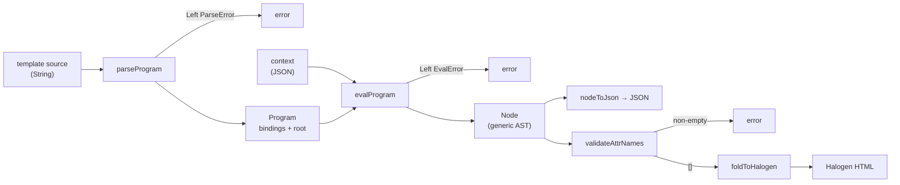
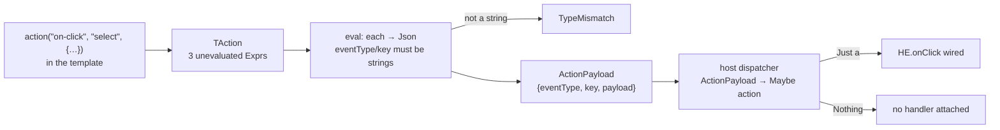

# Templating language — reference

This is the **current-state reference** for the language: what it is, how it
parses, what it evaluates to, and how a host embeds it. It is written to be read
start-to-finish by an LLM or an agent with no other context.

For the *historical* design record — why each decision went the way it did, in
the order the decisions were made — see
[`templating-language.md`](templating-language.md). Where the two disagree, this
file is correct: the other one is a running log that preserves superseded
intermediate designs on purpose.

---

## 1. Overview

A template turns a JSON value into a **document tree**. It is not an HTML
templating engine — it never produces markup text. It produces a small AST
(`Node`), and the host decides what that becomes: Halogen HTML, JSON, or
anything else.

A program is two parts: an optional block of `@name=expr` **bindings**, then
exactly one **root element**.

```
@items=$ctx.items
@n=cardinality($items)
.div(class: "items",
  .h1("Items"),
  .p("there are `$n` of them"),
  .ul(map($items, (i) => .li(action("on-click", "select", {"id": $i.id}), $i.name))))
```

Given `{"items":[{"id":"a1","name":"alpha"},{"id":"a2","name":"beta"}]}` this
evaluates to a `div` with three children, the last holding two `li`s, each
carrying a structured action payload.

Three leader characters, one job each:

| Char | Job | Example |
|---|---|---|
| `.` | starts an element | `.div(...)` |
| `$` | reads a bound name or a `$ctx` path (a *getter*) | `$n`, `$ctx.items`, `$fn(x)` |
| `@` | defines a binding, computation block only (a *setter*) | `@n=cardinality($items)` |

`$ctx` is the input JSON, always in scope. There are **no comments** in the
language.

---

## 2. Design

Five properties are load-bearing; changes that break them are breaking changes.

**Output is a generic AST, not markup.** `Templating.Eval` produces `Node`, which
has no Halogen (or DOM, or HTML) dependency. The fold to a real UI lives in a
separate package. This is what lets the same template be evaluated server-side,
in a CLI, or in a browser.

**Actions are opaque to the language.** `action(...)` attaches a
`{eventType, key, payload}` triple to an element. The language validates its
*shape*, never its *meaning* — it has no idea what `"select"` does. The host maps
payloads to real events. See §5.

**The builtin set is fixed. There is no extension registry.** A host cannot
inject functions. The list in §3.6 is all of them. This is deliberate: a template
is data that can be stored, shipped between systems, and evaluated by either
implementation without carrying an environment with it.

**No recursion, by construction.** A binding's value is inserted into the
environment only *after* its right-hand side is evaluated, so a closure's
captured environment never contains its own name. `@fact=(n) => $fact($n)`
parses, and fails at call time with `UnknownFunction "fact"`.

**No short-circuiting anywhere.** Every argument to every builtin call is fully
evaluated before the builtin runs. The one exception is the *template-block*
`branch(...)`, which selects a node before evaluating it — see §3.5.

### Two implementations

`templating` (PureScript) and `templating-hs` (Haskell) are independent
implementations of one grammar, not a shared core behind an FFI. Same module
names, same constructors, same `nodeToJson` output. They are kept in agreement
by hand-ported fixtures (`templating/test/Test/Fixtures.purs` is the original;
`templating-hs/test/unit/Templating/EvalSpec.hs` mirrors it).

**This agreement is not mechanically enforced** — there is no shared golden
corpus and no cross-language conformance runner, so the suites can drift. If you
change the language, change both.

Substrate differences (not language differences): aeson `Value` vs argonaut
`Json`; `Data.Map`/`Text` vs `Foreign.Object`/`String`; megaparsec backtracks on
a failed alternative by default where `purescript-parsing` needs explicit `try`.
Haskell record fields are prefixed (`apEventType`, `neTag`) where PureScript uses
bare labels (`eventType`, `tag`).

---

## 3. Grammar

Whitespace, including newlines, is insignificant except as a token separator.
The blank line between the two blocks is conventional, not required — `@` and `.`
already disambiguate.

```
program        := binding* node

binding        := "@" ident "=" expr

expr           := bool-lit | lambda | special-form | call | path
                | string-lit | number-lit | array-lit | object-lit

path           := "$" ident ("." ident)*
call           := ["$"] ident "(" [expr ("," expr)* [","]] ")"
lambda         := "(" [ident ("," ident)*] ")" "=>" expr
special-form   := "map"    "(" expr "," expr ")"
                | "filter" "(" expr "," expr ")"
                | "scan"   "(" expr "," expr "," expr ")"
bool-lit       := "true" | "false"
number-lit     := digit+ ["." digit+]
string-lit     := '"' (char | "`" expr "`")* '"'
array-lit      := "[" [expr ("," expr)* [","]] "]"
object-lit     := "{" [quoted-key ":" expr ("," ...)* [","]] "}"

node           := "." ident "(" [node-arg ("," node-arg)* [","]] ")"
node-arg       := attr | action | child          -- all attrs/actions before any child
attr           := (ident | quoted-key) ":" expr
action         := "action" "(" expr "," expr "," expr ")"
child          := expr | node | template-map | template-branch
template-map   := "map" "(" expr "," "(" ident ")" "=>" node ")"
template-branch:= "branch" "(" node ("," expr "," node)* ")"

ident          := letter (alphanum | "_" | "-")*
quoted-key     := '"' char* '"'                  -- no interpolation
```

### 3.1 Identifiers

Must start with a **letter**; may then contain letters, digits, `_`, and `-`.
So `my-var`, `foo_bar`, `data-count` are all valid, and there is no ambiguity
with a number literal. Attribute keys may also be double-quoted, which is the
only way to write a key an identifier can't represent (e.g. one with a space).
Object-literal keys are **always** quoted.

### 3.2 Interpolation

Inside a string literal, `` `expr` `` splices in any expression, not just a path:

```
.p("there are `$n`, first is `$lookup($items, 0, "none")`")
```

Values stringify for display (§4.3), so a number renders `3`, not `3.0`.

**TODO — string literals have no escape sequences.** `litPart` consumes
everything up to the next `"` or `` ` ``, and neither implementation recognises
a backslash, so those two characters simply cannot appear in a string. That
makes a whole class of output awkward to generate: anything carrying quoted
attributes or quoted code (`<a href="…">`, a `<script>` block, a JSON string
inside a JSON string). It bites hardest in non-browser hosts, which emit text
rather than building DOM. A fix wants `\"`, `` \` `` and `\\` at minimum, added
to `litPart` in *both* parsers plus a fixture on each side; the open questions
are whether to also take `\n`/`\t` (the language has no other way to express
them, but a template is line-oriented already) and whether an escape should be
legal in a `quoted-key` too, for symmetry.

### 3.3 Calls

`name(args)` and `$name(args)` are the same thing: look `name` up in the
environment, and if it isn't bound, fall through to the builtin table. A user
binding therefore *shadows* a builtin of the same name — accepted, not guarded
against.

Only a **single-segment** name is callable. `$ctx.foo(...)` is always rejected,
though where depends on position: as a bare child it parses (into `Call
["ctx","foo"] […]`) and fails at eval with a `TypeMismatch`, because callability
isn't knowable until the environment is resolved; in a binding, an attribute
value, or an interpolation the parser rejects it first, since `$ctx.foo` matches
as a plain path and the following `(` is then unexpected.

### 3.4 Argument ordering in a node

**Every attribute and the `action(...)` must come before any child.**
`.foo(.p("hi"), "bar": "baz")` is a **parse error**, enforced after parsing the
argument list. A node may have **at most one** `action(...)`; a second is also a
parse error.

A bare value in a node's argument list is a **text child**, not an attribute:
`.td($item.title)` and `.h1("Title")` both produce text children.

### 3.5 `map` and `branch` exist at two levels

Both names are parsed differently depending on position, with genuinely
different semantics:

| | Expression position | Child position |
|---|---|---|
| `map` | `MapExpr` — transforms an array into a new **array** | `TMap` — repeats a **node** per element |
| `branch` | builtin — picks a **value**; **all** arguments pre-evaluated | `TBranch` — picks a **node**; **only the chosen one** is evaluated |

The template-block `branch` is therefore strictly more forgiving: an unreachable
node's own errors never surface. The expression-level one requires every value in
the chain to be safe to evaluate regardless of which predicate wins.

`$ctx.items.map(...)` (OOP-suffix style) **does not parse**. It is
`map($ctx.items, (item) => ...)`.

### 3.6 Builtins

Fixed set. Arity is strict.

| Builtin | Meaning |
|---|---|
| `cardinality(x)` / `count(x)` | array length, or number of object keys. Aliases. |
| `not(a)` | boolean negation |
| `and(a, ...)` / `or(a, ...)` | variadic; `and()` is `true`, `or()` is `false` (vacuous cases, not rejected) |
| `eq(a, b)` | deep structural equality over any JSON |
| `lt` / `lte` / `gt` / `gte` `(a, b)` | numeric comparison; both arguments must be numbers |
| `has(container, key)` | presence test — **never errors**; missing field, out-of-range index, or wrong-shaped input all answer `false` |
| `lookup(container, key, fallback)` | dynamic field/index access by a *computed* key; **never errors** — the mandatory third argument is returned for anything missing or mis-shaped |
| `branch(fallback, p1, v1, p2, v2, ...)` | "if p1 then v1, … else fallback", as a value |
| `map(arr, fn)` / `filter(arr, fn)` | as expected; `fn` is any expression evaluating to a closure |
| `scan(arr, init, fn)` | `scanl` semantics — output is `[init, f(init,x1), f(f(init,x1),x2), …]`, one **longer** than the input, seed first. `fn` takes `(acc, item)`. |

`has` and `lookup` are deliberately tolerant: they exist to test for something
you don't already know is there, so erroring on exactly the case they detect
would defeat the point.

### 3.7 Lambdas and closures

`(a, b) => expr` is a first-class value. Write it inline, or bind it and reuse
it:

```
@is-big=(x) => gt($x.size, 10)
@apply=(f, x) => $f($x)
.ul(map(filter($ctx.items, $is-big), (i) => .li($i.name)))
```

Closures capture lexically — the body sees whatever was in scope where it was
written. A closure can be passed to another closure (genuine higher-order use).
Arity mismatch is an eval-time error. A closure used where a plain value is
expected (interpolated, stored in a literal, passed to a fixed builtin) is a
`TypeMismatch` telling you to call it first.

---

## 4. AST

Three types matter: `Expr` and `TemplateNode` (parser output, unevaluated) and
`Node` (evaluator output).

### 4.1 Parser output

```purescript
type Program = { bindings :: Array (Tuple String Expr), root :: TemplateNode }

data Expr
  = Path (Array String)                       -- $ctx.items → ["ctx","items"]
  | Call (Array String) (Array Expr)
  | StringLit (Array StringPart)
  | NumberLit Number
  | BoolLit Boolean
  | ArrayLit (Array Expr)
  | ObjectLit (Array (Tuple String Expr))
  | LambdaExpr (Array String) Expr
  | MapExpr Expr Expr                         -- map(arr, fn)
  | FilterExpr Expr Expr
  | ScanExpr Expr Expr Expr                   -- scan(arr, init, fn)

data StringPart = Lit String | Interp Expr

data TAction = TAction Expr Expr Expr         -- eventType, key, payload

data TemplateNode
  = TElement String (Array (Tuple String Expr)) (Maybe TAction) (Array TemplateNode)
  | TValue Expr                               -- a bare value → text child
  | TMap Expr String TemplateNode             -- array, bound name, body
  | TBranch TemplateNode (Array (Tuple Expr TemplateNode))
```

`Call`'s callee is an array to leave room for a dotted callee later; today the
evaluator rejects anything but one segment.

### 4.2 Evaluator output

```purescript
data Node
  = NElement
      { tag      :: String
      , attrs    :: Map String String         -- resolved, stringified
      , action   :: Maybe ActionPayload
      , children :: Array Node
      }
  | NText String

type ActionPayload = { eventType :: String, key :: String, payload :: Json }
```

Note `attrs` values are **strings** by the time evaluation finishes, while
`action.payload` stays arbitrary `Json`. That asymmetry is intentional: an
attribute becomes a DOM attribute (a string), a payload goes to program code.

### 4.3 Display stringification

Anything landing in text or an attribute goes through one rule:

| JSON | Rendered |
|---|---|
| string | itself, unquoted |
| number | integral values without a decimal point (`3`, not `3.0`) |
| boolean | `true` / `false` |
| null | empty string |
| array / object | compact JSON |

### 4.4 `nodeToJson`

Both implementations export `nodeToJson :: Node -> Json`, an inspection
serialization — **not** a wire format either side reads back:

```json
{"type":"element","tag":"p","attrs":{"class":"x"},
 "action":{"eventType":"on-click","key":"select","payload":{"id":"a1"}},
 "children":[{"type":"text","text":"hello"}]}
```

`action` is `null` when absent. This is what the CLI prints (§6) and what both
implementations are asserted to agree on.

### 4.5 Errors

Parse failures are the parser library's own error type. Evaluation fails with:

```purescript
data EvalError
  = UnboundName String        -- a $name that isn't bound
  | UnknownFunction String    -- a call to a name that's neither bound nor a builtin
  | PathNotFound (Array String)
  | TypeMismatch String       -- wrong shape, bad arity, closure misuse, bad event type
```

Evaluation is all-or-nothing: there is no partial output on error.

---

## 5. Integration

### 5.1 The pipeline



Everything up to `Node` is host-agnostic and exists in **both** languages. The
last two steps — `validateAttrNames` and `foldToHalogen` — are
`templating-halogen`, PureScript and browser only. A host targeting something
else writes its own fold over `Node`; nothing else needs reimplementing.

**`validateAttrNames` is opt-in and you should call it.** The language allows
attribute keys that the DOM rejects (`isValidAttrName` permits only letters,
digits, `-`, `_` — deliberately stricter than HTML). Folding an invalid key
throws an uncaught `DOMException` mid-render. `validateAttrNames` returns every
offending key (`[]` means safe); render an error instead of folding.

Minimal host:

```purescript
case parseProgram src of
  Left err -> renderError ("parse error: " <> show err)
  Right program -> case evalProgram ctxJson program of
    Left err -> renderError ("eval error: " <> show err)
    Right node -> case validateAttrNames node of
      [] -> foldToHalogen dispatch node
      bad -> renderError ("invalid attribute name(s): " <> show bad)
```

### 5.1b Expression-rooted programs (JSON mode)

A host that wants the *data* half of the language on its own — generate a JSON
payload, not a document — can root a program at an expression instead of an
element. Both implementations expose this as a second entry point:

```haskell
-- templating-hs
parseJsonProgram :: Text -> Either (ParseErrorBundle Text Void) JsonProgram
evalJsonProgram  :: Value -> JsonProgram -> Either EvalError Value
```

```purescript
-- templating (PureScript)
parseJsonProgram :: String -> Either ParseError JsonProgram
evalJsonProgram  :: Json -> JsonProgram -> Either EvalError Json
```

Same computation block, same expression language, same builtins; only the root
differs, and the two roots can never be confused because an element root always
starts with `.` and no expression form does. The result is a real JSON value:
nothing passes through `jsonToDisplayString`, so numbers stay numbers and nested
objects stay objects — which is exactly what the `Node` path cannot give you,
since `NElement`'s attributes are a string-to-string map.

```
@posts=$ctx.datasets.index.posts
@n=cardinality($posts)
{"count": $n, "titles": map($posts, (p) => $p.title)}
```

The PureScript fixtures for this mode live in `templating/test/Test/Main.purs`
(not `Test/Fixtures.purs`, which only covers `Node`-rooted programs) and are not
held to cross-language agreement with `templating-hs`'s own JSON-mode fixtures
in `EvalSpec.hs` — both exercise the shared expression language (bindings,
closures, builtins, `map`/`filter`/`scan`), so a divergence there would still
surface in the ported `Node`-rooted fixtures either package holds.

### 5.2 Action binding

This is the whole interactivity story. The language carries an opaque triple;
the host decides what it means.



The dispatcher is the host's single point of control, and there are exactly two
modes:

- **Read-only** — pass `const Nothing`. Every action is inert; no click handler
  is attached at all. This is the safe default for rendering templates you
  don't control.
- **Interactive** — pattern-match `key`, decode `payload`, return your own
  `Action`. Returning `Nothing` for an unrecognized key is the recommended
  posture: silently inert, matching how `has`/`lookup` never error.

```purescript
dispatch :: ActionPayload -> Maybe Action
dispatch ap = case ap.key of
  "select" -> SelectItem <$> hush (decodeJson ap.payload)
  _        -> Nothing        -- unknown key: no effect, no error
```

**`eventType` is not validated against any vocabulary.** Evaluation requires it
to reduce to a string and passes that string through verbatim; it can be computed
(`action($ctx.eventName, …)`), and a host is free to invent whatever event/hook
names it wants — a DOM host knows `on-click`, an email or static-site renderer
has no DOM events at all. There used to be a fixed
`supportedActionEventTypes = ["on-click"]` check in both `Templating.Eval`s; it
is gone.

The consequence is on the host: **a dispatcher must branch on `eventType`, not
assume it.** `foldToHalogen` wires `HE.onClick` for every action `dispatch`
accepts, so a Halogen host using a second event type has to return `Nothing` for
the ones it does not want treated as a click.

### 5.3 Consuming the packages

Neither half is on a registry yet. Pin by git; note `subdir`, this is a
mono-repo.

```yaml
# spago.yaml
workspace:
  extraPackages:
    templating:
      git: "https://github.com/lucasdicioccio/templating-lang.git"
      ref: v0.2.0
      subdir: templating
    templating-halogen:
      git: "https://github.com/lucasdicioccio/templating-lang.git"
      ref: v0.2.0
      subdir: templating-halogen
```

```
-- cabal.project
source-repository-package
  type: git
  location: https://github.com/lucasdicioccio/templating-lang.git
  tag: v0.2.0
  subdir: templating-hs
```

Depend on `templating` alone if you never fold to Halogen — that is what keeps
the core usable outside a browser.

---

## 6. Command line

`templating-cli` evaluates a template against a context and prints
`nodeToJson`'s output — for shell scripts, CI checks, and eyeballing what a
template actually produces.

```bash
spago bundle -p templating-cli --platform node --outfile dist/templating-cli.js
node templating-cli/dist/templating-cli.js <template-file> <context-json-file>
```

```
usage: templating-cli <template-file> <context-json-file>
```

- **stdout** — the evaluated AST as compact JSON, on success.
- **stderr + exit 1** — on a bad context file, a parse error, or an eval error.
  The message names which: `invalid JSON context (…)`, `parse error (…)`,
  `eval error: …`.
- Exit code is the thing to test in a script.

```bash
# validate every template in a directory, fail the build on the first bad one
for t in templates/*.tmpl; do
  node dist/templating-cli.js "$t" fixtures/ctx.json > /dev/null \
    || { echo "bad template: $t" >&2; exit 1; }
done

# pull one value out of the rendered tree
node dist/templating-cli.js page.tmpl ctx.json | jq -r '.children[0].text'
```

It depends on `templating` only, never `templating-halogen`, so it needs no DOM
and no browser — just Node's `fs`.

For an interactive equivalent, `playground/serve.sh` runs a browser playground
with live parse/eval, the AST, the rendered output, and an action log.

---

## 7. Gotchas

Ranked by how often they actually bite.

1. **Attributes before children.** `.foo(.p("x"), a: "b")` is a parse error.
2. **`.map` suffix syntax is gone.** Use `map(arr, (x) => …)`.
3. **A bare value in a node is a text child**, not an attribute.
4. **Object-literal keys must be quoted**; attribute keys need not be.
5. **No comments.** Nothing is stripped; `--` is a parse error.
6. **No recursion**, and **no short-circuiting** in the expression-level
   `branch` — every branch value must be evaluable.
7. **A closure is not a value.** Interpolating `` `$my-fn` `` is a
   `TypeMismatch`; call it.
8. **`eventType` needs quotes** — `action("on-click", …)`, not
   `action(on-click, …)`.
9. **Context field names are the host's**, not the language's. Most "why is this
   `PathNotFound`" turns out to be a wrong field name — dump the context and
   check.
10. **No escapes in a string literal** — a `"` or a `` ` `` cannot appear in one
    at all, and a backslash is just a backslash. See the TODO in §3.2.
